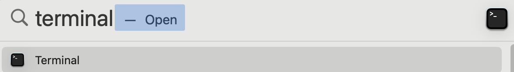
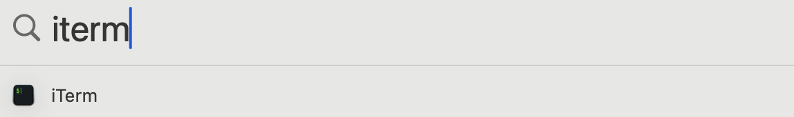

This is a simple end to end Databricks Lakeflow Connect SQL Server demo.

The database, firewall, connection, and pipelines are created and automatically deleted after an hour. A tiny database instance is created meant for a functional demo. 

# Install CLI tools 
Copy and paste the commands in a terminal window to [install CLI (one time or upgrade)](README.installcli.md)

# Steps to run a demo

1. Open a new terminal using one of the ways below.  

    <details>
    <summary>OSX terminal</summary>

    - press Command Space and open Spotlight Search
    - type `terminal`
    - click `terminal` icon     
    </details>

    <details>
    <summary>iterm2 from brew install</summary>

    - press Command Space and open Spotlight Search
    - type `iterm`
    - click `iterm` icon     
    </details>

    <details>
    <summary>ttyd if setup from launchctl at <a href="http://localhost:7681/"> http://localhost:7681/</a></summary>

    1. open a new tab from a browser with URL http://localhost:7681/ 
    </details>

    <details>
    <summary>ttyd started from a terminal at  <a href="http://localhost:7681/"> http://localhost:7681/</a></summary>

    2. open `terminal` or `iterm` from the above
    3. run ttyd 
    ```bash
    nohup ttyd -W tmux new -A -s lakeflow.ttyd &
    ```
    4. open a new tab from a browser with URL http://localhost:7681/ 
    </details>

2. Initialize environment variables in a new terminal session for a new database
  
    [Customized](#frequently-used-environmental-variables) with `export` variables if required.

    ```bash
    source  <(curl -s -L https://raw.githubusercontent.com/rsleedbx/lakeflow_connect/refs/heads/main/00_lakeflow_connect_env.sh)
    ```

3. Start and configure one of the below database instances

    <details>
    <summary>SQL Server</summary>

    <details>
    <summary>SQL Server: Azure SQL Server</summary>

    ```bash
    source  <(curl -s -L https://raw.githubusercontent.com/rsleedbx/lakeflow_connect/refs/heads/main/sqlserver/01_azure_sqlserver.sh)
    source  <(curl -s -L https://raw.githubusercontent.com/rsleedbx/lakeflow_connect/refs/heads/main/sqlserver/02_sqlserver_configure.sh)
    ```
    </details>

    <details>
    <summary>SQL Server: Azure SQL Server Managed Instance</summary>
    <b>The cost is relatively high if the free version is not available.</b>

    ```bash
    source  <(curl -s -L https://raw.githubusercontent.com/rsleedbx/lakeflow_connect/refs/heads/main/sqlserver/01_azure_managed_instance.sh)
    source  <(curl -s -L https://raw.githubusercontent.com/rsleedbx/lakeflow_connect/refs/heads/main/sqlserver/02_sqlserver_configure.sh)
    ```

    </details>  
    <details>
    <summary>SQL Server: Google CloudSQL SQL Server</summary>

    ```bash
    source  <(curl -s -L https://raw.githubusercontent.com/rsleedbx/lakeflow_connect/refs/heads/main/sqlserver/01_gcloud_sqlserver_instance.sh)
    source  <(curl -s -L https://raw.githubusercontent.com/rsleedbx/lakeflow_connect/refs/heads/main/sqlserver/02_sqlserver_configure.sh)
    ```
    </details>  

    </details SQL Server>

    <details>
    <summary>Postgres</summary>

    <details>
    <summary>Postgres: Azure Postgres Flexible Server</summary>

    ```bash
    source  <(curl -s -L https://raw.githubusercontent.com/rsleedbx/lakeflow_connect/refs/heads/main/postgres/01_azure_postgres.sh)
    source  <(curl -s -L https://raw.githubusercontent.com/rsleedbx/lakeflow_connect/refs/heads/main/postgres/02_postgres_configure.sh)
    ```
    </details>  
    </details Postgres>  


4.  Start the Databricks Lakeflow Connect Database Demo

    ```bash
    source  <(curl -s -L https://raw.githubusercontent.com/rsleedbx/lakeflow_connect/refs/heads/main/03_lakeflow_connect_demo.sh)
    ```

5.  [Optional] to interact with the database using the native CLI 

    1. as a user USER_USERNAME
    ```
    SQLCLI
    ```

    2. as a DBA DBA_USERNAME
    ```
    SQLCLI_DBA
    ```

**Don't reboot the laptop while the demo is running.  Rebooting the laptop will kill the background cleanup jobs.**

# Frequently Used Environmental Variables

## `CDC_CT_MODE`=**`BOTH`**|`CDC`|`CT`|`NONE` BOTH is the default

Example usage:

Only replicate tables that do not have primary keys.

```bash
export CDC_CT_MODE=CDC
. ./00_lakeflow_connect_env.sh
```

| CDC_CT_MODE   | Postgres | SQL Server |
| :-:   | ------- | ------- |
| CDC           | set `replica full` on tables without pk | enable CDC on tables without pk |
| CT            | set `replica default` on tables with pk  | enable CT on tables  with pk    |
| BOTH          |  set `replica full` on tables without pk,  <br> set `replica default` on tables with pk  | enable CDC on tables without pk, <br> enable CT on tables  with pk   |
| NONE          | set `replica nothing` on the tables | enable CDC and CT on the table |

##  `DB_FIREWALL_CIDRS="0.0.0.0/0"` 

The default is to open the database to public. For security, a random server name, catalog name, user name, dba name, user password, dba password are used.  The database is deleted in 1 hour by default.

Example usage:

Set up firewall to allow connections from `192.168.0.0/24` and `10.10.10.12/32`

```bash
export DB_FIREWALL_CIDRS="192.168.0.0/24 10.10.10.12/32"
. ./00_lakeflow_connect_env.sh
```

## `DELETE_DB_AFTER_SLEEP=61m`

The default is to delete the database objects (server, catalog, schema, tables, UC Connection) the script creates after this many minutes.  
- To not delete, make it `DELETE_DB_AFTER_SLEEP=""`
- To not change the time, make it `DELETE_DB_AFTER_SLEEP="67m"` for example.

If the server was already created, then it won't be deleted even if this is set.

Example usage:

```bash
export DELETE_DB_AFTER_SLEEP=""
. ./00_lakeflow_connect_env.sh
```

## `DELETE_PIPELINES_AFTER_SLEEP=63m`

The default is to delete the pipeline objects (gateway, ingestion, jobs) the script creates after this many minutes.  
- To not delete, make it `DELETE_PIPELINES_AFTER_SLEEP=""`
- To not change the time, make it `DELETE_PIPELINES_AFTER_SLEEP="67m"` for example.

Example usage:

```bash
export DELETE_PIPELINES_AFTER_SLEEP=""
. ./00_lakeflow_connect_env.sh
```